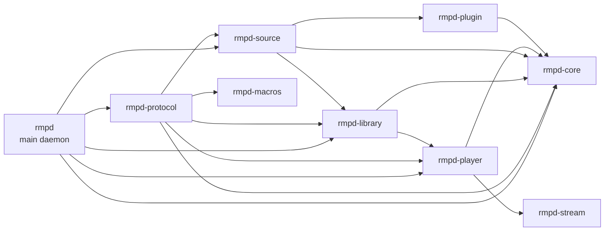

<p align="center">
  
</p>

<p align="center">
  <a href="https://github.com/M0Rf30/rmpd/actions/workflows/ci.yml"></a>
  <a href="https://github.com/M0Rf30/rmpd/actions/workflows/security.yml"></a>
  <a href="LICENSE-MIT"></a>
</p>

**rmpd** is a modern, high-performance, memory-safe music server written in pure Rust. It aims for 100% compatibility with the Music Player Daemon (MPD) protocol while providing first-class extensibility through a plugin architecture.

## Features

- 🎵 **MPD Protocol Compatible** - Works with existing MPD clients (ncmpcpp, mpc, Cantata)
- 🦀 **Pure Rust** - Memory-safe, fast, and reliable
- 🔌 **Extensible** - Plugin system for decoders, outputs, and inputs
- 🎧 **High-Quality Audio** - DSD support, ReplayGain, gapless playback, crossfade
- 🎼 **Format Support** - FLAC, MP3, Ogg Vorbis, WAV, AAC, DSD (DoP and native)
- 🏠 **Multi-Room** - Plays to all enabled outputs at once; stream over HTTP (`httpd` output) or feed an external Snapcast server via FIFO
- 🖥️ **Desktop Integration** - Native MPRIS D-Bus interface (media keys, `playerctl`, GNOME/KDE) plus mDNS auto-discovery
- 🌐 **Remote Libraries** - Browse and stream from OpenSubsonic servers (Navidrome, Airsonic, gonic) as a music source, built behind the `subsonic` Cargo feature
- ⚡ **Efficient** - Runs on everything from Raspberry Pi to high-end servers

## Architecture

```
rmpd/
├── rmpd/               # Main daemon binary (CLI, startup wiring)
├── rmpd-core/          # Shared domain types, errors, config, queue/state
├── rmpd-protocol/      # MPD protocol parsing/command handling/MPRIS/mDNS
├── rmpd-player/        # Playback engine, outputs, resampling, crossfade
├── rmpd-library/       # Scanner, metadata/artwork extraction, SQLite DB
├── rmpd-source/        # External music source bridge (OpenSubsonic feature)
├── rmpd-plugin/        # Plugin/source traits and abstractions
├── rmpd-stream/        # HTTP/ICY stream input helpers
└── rmpd-macros/        # Proc-macros (CommandMetadata derive)
```

### Workspace Directory Analysis (rmpd*)

- **rmpd/**
  - Contains the `rmpd` executable entrypoint and top-level runtime wiring.
  - Feature flags fan out from here: `pipewire` (player backend) and `subsonic` (source integration).
- **rmpd-core/**
  - Foundational crate used by most others.
  - Owns shared config/state types and feature-gated error domains (`database-errors`, `player-errors`, `library-errors`, `protocol-errors`).
- **rmpd-protocol/**
  - Implements MPD command parsing/dispatch and protocol-facing behavior.
  - Depends on `rmpd-macros` for command metadata derive and integrates MPRIS + mDNS.
- **rmpd-player/**
  - Audio pipeline crate: decoders, output backends, resampler/crossfade/gain.
  - Optional Linux-native PipeWire backend behind `pipewire` feature.
- **rmpd-library/**
  - Library/database subsystem with scanner, watcher, metadata/artwork, and SQLite/Tantivy-backed search.
  - Includes fingerprint support and integration tests/compatibility suite.
- **rmpd-source/**
  - Source integration layer; `subsonic` feature pulls OpenSubsonic/HTTP dependencies.
  - Bridges remote catalogs into local browse/play paths.
- **rmpd-plugin/**
  - Lightweight abstractions and async traits for pluggable sources/components.
- **rmpd-stream/**
  - Streaming utility crate for HTTP/ICY input used by playback/source paths.
- **rmpd-macros/**
  - Proc-macro crate for compile-time metadata generation (`#[derive(CommandMetadata)]`).

### Crate Dependency Diagram



## Quick Start

### Prerequisites

**System dependencies:**

```bash
# Ubuntu/Debian
sudo apt-get install libasound2-dev pkg-config

# macOS
brew install pkg-config
```

### Build

```bash
cargo build --release
```

### Run

```bash
./target/release/rmpd --bind 127.0.0.1 --port 6600 --music-dir ~/Music
```

### Common Usage

```bash
# Start with explicit config file
./target/release/rmpd --config ~/.config/rmpd/rmpd.toml

# Start with journald/syslog-style logging (useful for service-like runs)
./target/release/rmpd --config ~/.config/rmpd/rmpd.toml --syslog
```

After startup, any MPD client can connect to `<bind_address>:<port>` from your config.

### Running as a systemd Service

For Debian packaging, the shipped unit is `debian/rmpd.service` and runs:

- user/group: `rmpd:rmpd`
- working directory: `/var/lib/rmpd`
- config: `/etc/rmpd/rmpd.toml`
- command: `/usr/bin/rmpd --config /etc/rmpd/rmpd.toml --syslog`

Typical service workflow:

```bash
# Reload unit files after installation or manual unit changes
sudo systemctl daemon-reload

# Enable on boot and start now
sudo systemctl enable --now rmpd.service

# Check health and recent logs
systemctl status rmpd.service
journalctl -u rmpd.service -n 200 --no-pager

# Restart after config changes
sudo systemctl restart rmpd.service
```

### Test with mpc

```bash
# Check status
mpc status

# Update library
mpc update

# Add and play music
mpc add /
mpc play

# Play internet radio (any HTTP/HTTPS stream URL)
mpc add https://stream.example/radio.mp3
mpc play
mpc current   # shows the live ICY "now playing" title for streams
```

## Configuration

Create `~/.config/rmpd/rmpd.toml`:

```toml
[general]
music_directory = "~/Music"
playlist_directory = "~/.config/rmpd/playlists"
db_file = "~/.config/rmpd/database.db"
log_level = "info"

[network]
bind_address = "127.0.0.1"
port = 6600
mpris = true

[audio]
default_output = "alsa"
gapless = true
replay_gain = "auto"
buffer_time = 500

[[output]]
name = "Local Audio"
type = "cpal"          # system audio via cpal (ALSA / PulseAudio / PipeWire host)
enabled = true

[[output]]
name = "PipeWire"      # native pipewire-rs client; follows the graph rate (build with --features pipewire)
type = "pipewire"
enabled = false

[[output]]
name = "HTTP Stream"   # listen on http://<host>:8000 — play in a browser or another MPD
type = "httpd"
enabled = false
port = 8000
encoder = "wav"        # "wav" or "pcm"

[[output]]
name = "Snapcast FIFO" # feed an external snapserver for synchronized multi-room
type = "fifo"
enabled = false
path = "/tmp/snapfifo"
```

See [rmpd.toml](rmpd.toml) for a complete configuration example.

### Music Sources (OpenSubsonic)

rmpd can aggregate a remote [OpenSubsonic](https://opensubsonic.netlify.app/)
server (Navidrome, Airsonic, gonic, …) into its library as a *music source*.
The remote catalog is synced into the database at startup and on `update`, and
tracks stream on demand through the same HTTP path used for internet radio — so
any MPD client browses and plays them like local files (under mount-style paths
such as `home/Artist/Album/<id>.flac`, where the source name is the mount point).

Build with the `subsonic` feature, then add one or more `[[source]]` blocks:

```bash
cargo build --release --features subsonic
```

```toml
[[source]]
name = "home"                      # becomes the mount point (top-level directory)
type = "subsonic"
enabled = true
url = "https://music.example.com"
username = "alice"
password = "secret"                # or use `api_key = "..."` instead
# max_bitrate = 320                 # optional server-side transcode cap (kbps)
# format = "mp3"                    # optional transcode target ("raw" = no transcode)
```

Credentials are never written to logs. An unreachable server is skipped at
startup without aborting (previously-synced tracks remain browsable).

## Desktop Integration (MPRIS)

rmpd exposes a native [MPRIS](https://specifications.freedesktop.org/mpris-spec/latest/) interface on the session D-Bus as `org.mpris.MediaPlayer2.rmpd`. This lets Linux desktops (GNOME Shell, KDE Plasma), `playerctl`, lock screens, and multimedia keys discover and control rmpd directly — no external bridge such as `mpDris2` required.

It is enabled by default and can be toggled with `mpris` under `[network]`. Verify it with:

```bash
playerctl -p rmpd metadata
busctl --user introspect org.mpris.MediaPlayer2.rmpd /org/mpris/MediaPlayer2
```

rmpd also advertises itself over **mDNS/Zeroconf** so MPD clients on the local network can auto-discover the server.

## Audio Format Support

### Supported Formats

- **Lossless**: FLAC, WAV, ALAC, APE, WavPack, TrueAudio
- **Lossy**: MP3, Ogg Vorbis, Opus, AAC, MP4
- **High-Resolution**: DSD (DSF, DFF) with DoP and native playback
- **Streaming**: HTTP streams, Icecast, internet radio

### DSD Support

rmpd includes comprehensive DSD support:
- DSD64, DSD128, DSD256 and higher sample rates
- DoP (DSD over PCM) for wider DAC compatibility
- Native DSD playback for compatible hardware
- Automatic format detection and conversion
- DSD-to-PCM fallback decodes to a 44.1 kHz-family rate and resamples to the output device's native rate using the configured `resampler_quality`, so a sound server (e.g. PipeWire) never resamples internally — avoiding underruns and keeping DSD's ultrasonic noise out of the audible band

## Development

### Running Tests

```bash
cargo test --workspace --all-features
```

### Linting

```bash
# Format code
cargo fmt

# Run clippy
cargo clippy --workspace --all-targets --all-features
```

### CI/CD

This project uses GitHub Actions for CI/CD with:
- Multi-platform testing (Ubuntu, macOS)
- Multi-architecture builds (x86_64, ARM64)
- Strict linting with Clippy
- Security audits with cargo-audit and cargo-deny
- Code coverage reporting
- Automated dependency updates via Renovate

See [CI.md](CI.md) for detailed CI/CD documentation.

## Current Status

### Implemented ✅

- **Core Infrastructure**
  - MPD protocol server (TCP/Unix sockets)
  - Event bus system
  - Configuration management
  - Logging with tracing

- **Audio Playback**
  - Multi-format decoding (FLAC, MP3, Vorbis, WAV, AAC, DSD)
  - High-rate DSD support (DSD128, DSD256+)
  - Multiple output types (ALSA, PulseAudio, PipeWire)
  - Gapless playback
  - Crossfade and MixRamp transitions
  - ReplayGain support
  - Internet radio: HTTP(S) streaming input with Shoutcast/Icecast (ICY) "now playing" metadata
  - `httpd` output streams to browsers (`HTTP/1.0`) and to Shoutcast/Icecast clients (`ICY 200 OK` greeting + interleaved ICY `StreamTitle` metadata)

- **Library Management**
  - Filesystem scanning
  - SQLite database
  - Metadata extraction with lofty
  - Full-text search with tantivy
  - Album art support

- **MPD Protocol**
  - Core playback commands (play, pause, stop, seek)
  - Queue management (add, delete, move, shuffle)
  - Database queries (find, search, list)
  - Status and statistics
  - Playlist management (`.m3u`, `.pls`, XSPF/ASX; `.cue` sheets expand into range-restricted virtual tracks)
  - Output control

- **Desktop Integration**
  - Native MPRIS D-Bus interface (`org.mpris.MediaPlayer2.rmpd`)
  - Media keys, `playerctl`, and GNOME/KDE media controls
  - mDNS/Zeroconf service advertisement for client auto-discovery

- **Remote Libraries**
  - OpenSubsonic music sources (Navidrome, Airsonic, gonic) via the `subsonic` Cargo feature

### In Progress 🚧

- Compressed stream encoders (FLAC / Opus / Vorbis) for the `httpd` output
- Network storage backends (SMB / NFS)

## Compatibility

### Tested MPD Clients

- ✅ **mpc** - Command-line client
- ✅ **ncmpcpp** - TUI client
- ✅ **Cantata** - Qt GUI client
- ✅ **rmpc** - Modern TUI client
- 🚧 **MPDroid** - Android client (testing in progress)
- 🚧 **MPDluxe** - iOS client (testing in progress)

### Multi-Room Audio

rmpd plays to **all enabled outputs simultaneously**, so local audio and a
network stream can run at once. Two routes to networked/multi-room playback:

- **HTTP streaming** — enable a `type = "httpd"` output (default port 8000) and
  point any browser, phone, or another MPD/VLC at `http://<host>:8000`. Works
  today, no extra daemon required (`encoder = "wav"` or `"pcm"`).
- **Snapcast (synchronized)** — enable a `type = "fifo"` output writing to
  `/tmp/snapfifo` and run an external [Snapcast](https://github.com/badaix/snapcast)
  `snapserver` reading that FIFO for sample-accurate multi-room sync.

## Performance

rmpd is designed for efficiency:
- **Startup time**: < 500ms with 100k song library
- **Memory usage**: < 20MB idle, < 150MB with 100k songs loaded
- **CPU usage**: < 5% during FLAC playback
- **MSRV**: Rust 1.75.0+

## Project Goals

1. **100% MPD Compatibility** - Drop-in replacement for MPD
2. **Modern Architecture** - Clean, modular, testable code
3. **Extensibility** - Plugin system for community contributions
4. **Performance** - Efficient resource usage
5. **Multi-Protocol** - MPD, OpenSubsonic support

## Contributing

Contributions are welcome! Please:

1. Fork the repository
2. Create a feature branch
3. Make your changes with tests
4. Run `cargo fmt` and `cargo clippy`
5. Submit a pull request

See [CI.md](CI.md) for development guidelines and CI/CD information.

## License

Licensed under either of:

- Apache License, Version 2.0 ([LICENSE-APACHE](LICENSE-APACHE) or http://www.apache.org/licenses/LICENSE-2.0)
- MIT license ([LICENSE-MIT](LICENSE-MIT) or http://opensource.org/licenses/MIT)

at your option.

## Acknowledgments

- Inspired by the original [Music Player Daemon](https://www.musicpd.org/)
- Built with modern Rust audio libraries: [Symphonia](https://github.com/pdeljanov/Symphonia), [cpal](https://github.com/RustAudio/cpal), [lofty](https://github.com/Serial-ATA/lofty-rs)
- Special thanks to the Rust audio community

## Links

- **Documentation**: [CI.md](CI.md) - CI/CD and development guide
- **MPD Protocol**: [MPD Protocol Documentation](https://mpd.readthedocs.io/en/latest/protocol.html)
- **Issue Tracker**: [GitHub Issues](https://github.com/M0Rf30/rmpd/issues)
- **Discussions**: [GitHub Discussions](https://github.com/M0Rf30/rmpd/discussions)
