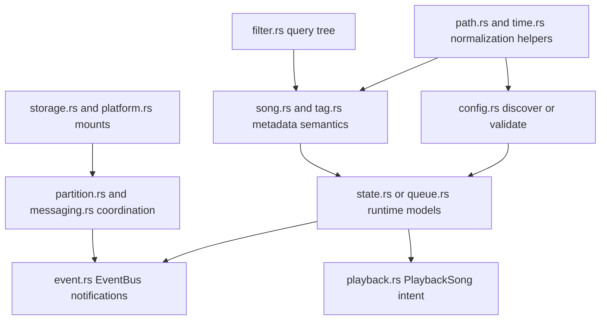
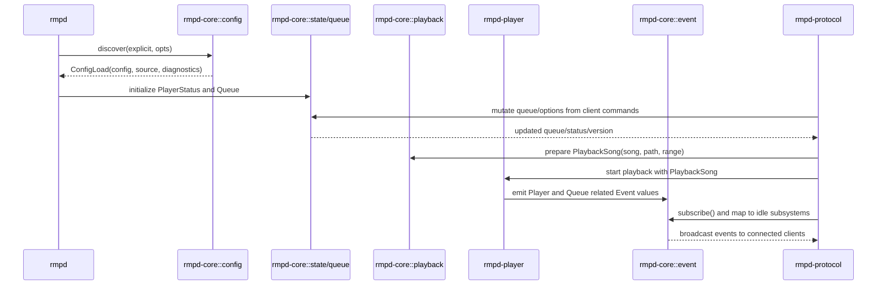
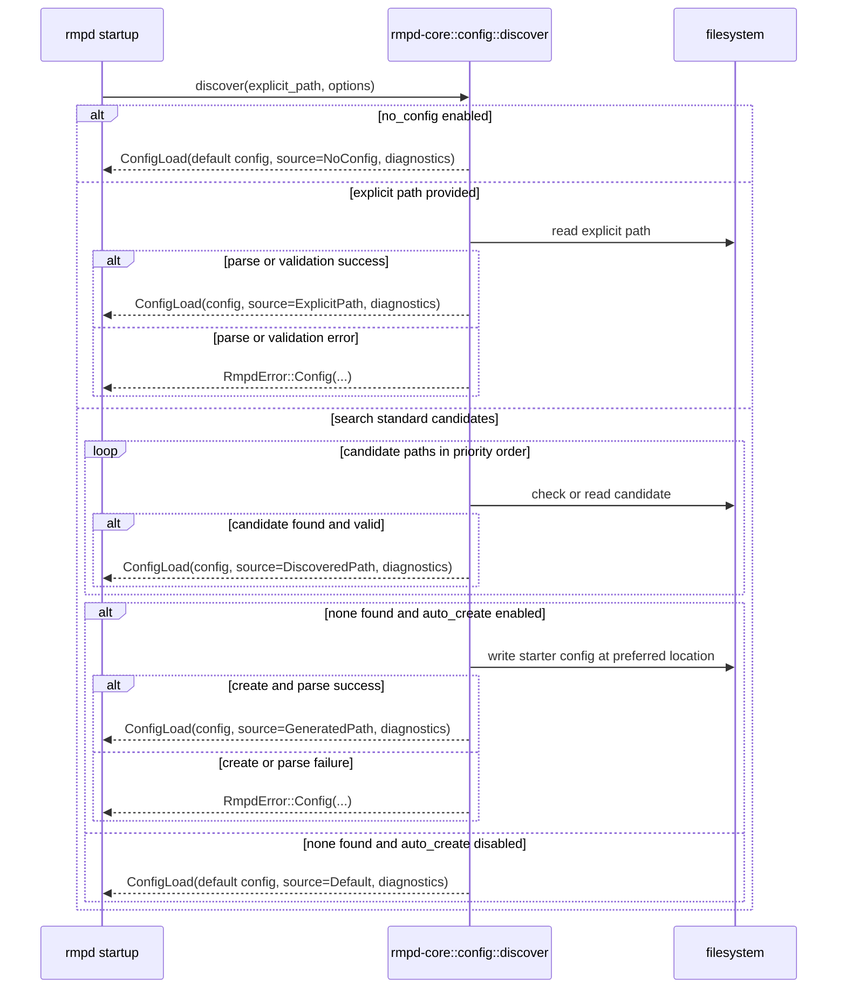

# rmpd-core Package: Purpose and Flow

This document explains what the rmpd-core package in folder rmpd-core is for, and how data and control flow through its modules.

## Purpose

rmpd-core is the shared domain and contract crate for the whole workspace.

It provides:

- common data models used across daemon, protocol, player, and library crates
- configuration schema, discovery, normalization, validation, and diagnostics
- shared error types and feature-gated dependency conversions
- event model and event bus abstractions
- queue, playback-intent, partition, messaging, mount, path, time, tag, and filter primitives

It intentionally does not run the daemon loop, decode audio, execute playback callbacks, or serve MPD protocol sockets directly. Those responsibilities live in other crates and depend on rmpd-core types.

## Package Boundaries

Core public module surface from lib.rs:

- config
- discovery
- error
- event
- filter
- messaging
- partition
- path
- playback
- queue
- song
- state
- storage
- tag
- time

## Architectural Role

rmpd-core is the contract layer between runtime components.

Examples:

- rmpd loads Config and passes policy to protocol and player layers.
- rmpd-player uses AudioFormat, PlayerState, Song, PlaybackSong, and Result or RmpdError.
- rmpd-protocol uses Event, Subsystem, Queue, PlayerStatus, PartitionState, and storage or mount models.
- rmpd-library and rmpd-source reuse Song, tag semantics, path utilities, and error categories.

## End-to-End Flow Inside rmpd-core

## 1. Configuration flow

Primary entry is Config::discover in config.rs.

Flow:

1. Resolve explicit config path if provided.
2. If no_config option is set, use defaults immediately.
3. Otherwise search candidate paths in priority order.
4. Optionally generate a starter config when missing.
5. Parse TOML, lint unknown or removed keys, expand paths, validate and normalize values.
6. Return ConfigLoad with:
   - parsed Config
   - ConfigSource provenance
   - diagnostics list for caller-side logging

Design intent:

- discover itself does not log; it returns diagnostics so the caller can initialize logging first, then replay diagnostics at configured log level.

## 2. Error flow

error.rs defines RmpdError plus Result alias.

Flow:

- module code returns category-specific errors such as Config, Player, Protocol, Library, Storage
- optional dependency errors are converted via feature-gated From impls
- callers can surface full display text or use detail_message for prefix-free user messaging

Design intent:

- centralize semantic error categories once, avoid ad-hoc string-only error taxonomies across crates.

## 3. Event flow

event.rs defines Event variants, Subsystem mapping, and EventBus wrapper over tokio broadcast.

Flow:

1. Producers emit Event values.
2. Event::subsystems maps event kind to MPD idle subsystems.
3. Consumers subscribe through EventBus::subscribe and react.

Notable policy:

- frequent PositionChanged and BitrateChanged do not trigger idle subsystem notifications, reducing idle-noise.

## 4. Playback state and queue flow

state.rs and queue.rs model runtime playback state and playlist mutation semantics.

Queue flow:

- Queue allocates stable non-zero song IDs.
- mutating operations (add, delete, move, swap, shuffle, clear) update version and maintain position reindexing.
- queue items can carry per-item range and custom tags.

Player status flow:

- PlayerState exposes atomic conversion helpers for lock-free engine checks.
- PlayerStatus aggregates state, transport metadata, replay-gain mode, queue counters, and error slot.

## 5. Playback intent flow

playback.rs defines PlaybackSong as a resolved play target:

- shared Arc Song metadata
- resolved_path that can be local path or stream URI
- optional range for cue or rangeid behavior

This type is the bridge from protocol selection logic into player execution.

## 6. Filtering and query semantics flow

filter.rs provides MPD-like filter parsing and evaluation model.

Flow:

- parse modern parenthesized expressions or legacy tag-value pairs
- normalize recognized keywords and tag behavior
- represent comparisons, timestamp filters, base filters, audio-format masks, and priority checks as typed FilterExpression tree

Design intent:

- preserve MPD-compatible query behavior in one place so protocol handlers do not duplicate parsing logic.

## 7. Song and tag semantics flow

song.rs and tag.rs encode metadata conventions:

- canonical known-tag mapping and display names
- fallback chains for albumartist and sort tags
- multi-valued tag support with deterministic ordering
- convenience methods for equality and contains matching

Design intent:

- keep metadata semantics consistent across scanner, query layer, and protocol output.

## 8. Path and time normalization flow

path.rs:

- tilde expansion
- URI detection
- safe relative-path checks
- MPD-like database tree ordering comparator

time.rs:

- SystemTime to unix-seconds conversion with pre-epoch clamp policy
- unix timestamp to RFC3339-like UTC string formatter

These are intentionally shared utilities to avoid small but impactful behavior drift between crates.

## 9. Messaging and partition flow

messaging.rs:

- in-memory pub-sub broker with per-channel queue cap
- subscriber-count-aware send semantics
- channel list and draining read behavior

partition.rs:

- PartitionState combines queue, status, atomic state, event bus, message broker, and assigned outputs
- PartitionManager enforces default partition and partition-count policy
- output assignment moves and listing behavior are centralized

Design intent:

- keep multi-client and multi-partition coordination semantics in one domain crate.

## 10. Storage mount flow

storage.rs and storage or platform.rs model mounted storage and OS backend contracts.

Flow:

- register or unregister logical mount points in MountRegistry
- serialize or deserialize mount state
- delegate mount or unmount operations to platform-specific MountBackend implementations

Design intent:

- keep persistent mount metadata and backend abstraction reusable by protocol handlers without embedding platform shell logic everywhere.

## Quick Module Interaction Diagram

## Sequence Diagram

## Sequence Diagram: Config Discovery and Fallbacks

## Practical Takeaway

When changing behavior that must be consistent across daemon, protocol, player, and scanner layers, rmpd-core is usually the right place.

When implementing runtime side effects such as audio callback behavior, socket serving, or filesystem scanning loops, higher-level crates should consume rmpd-core contracts instead of redefining them.

## Related Package Docs

- [rmpd package flow](docs/rmpd-package-flow.md)
- [rmpd-library package flow](docs/rmpd-library-package-flow.md)
- [rmpd-macros package flow](docs/rmpd-macros-package-flow.md)
- [rmpd-player package flow](docs/rmpd-player-package-flow.md)
- [rmpd-plugin package flow](docs/rmpd-plugin-package-flow.md)
- [rmpd-source package flow](docs/rmpd-source-package-flow.md)
- [rmpd-stream package flow](docs/rmpd-stream-package-flow.md)
