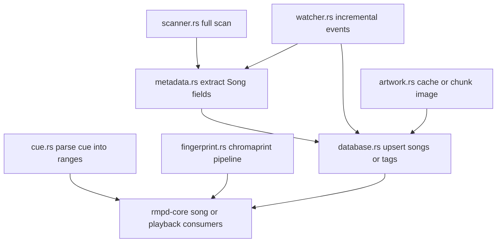
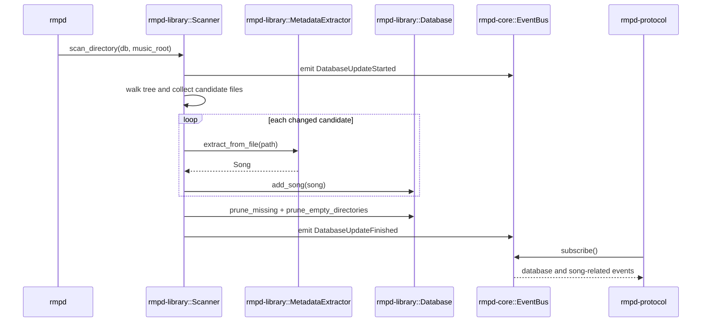

# rmpd-library Package: Purpose and Flow

This document describes what the `rmpd-library` package in folder `rmpd-library` is for, and how data moves through its modules.

## Purpose

`rmpd-library` is the music-catalog crate.

It provides:

- library persistence (SQLite schema, migrations, and query APIs)
- full-library scanning and incremental filesystem watching
- metadata extraction (tags, replaygain, audio properties)
- artwork lookup and caching (embedded and external cover files)
- CUE sheet parsing into virtual track ranges
- acoustic fingerprint generation via Chromaprint

It intentionally does not implement MPD socket protocol handling, playback scheduling, or audio output callbacks. Those layers consume `rmpd-library` results.

## Public Surface

From `src/lib.rs`, the package exports:

- `Database`, `DbPool`, `DirectoryListing`, `PlaylistInfo`, `WalkEntry`
- `Scanner`, `ScanStats`
- `FilesystemWatcher`
- `MetadataExtractor`, `Artwork`
- `AlbumArtExtractor`, `ArtLookup`, `ArtworkData`, `ExternalArtwork`, `find_external_cover`
- `CueTrack`, `parse_cue`
- `Fingerprinter`

## Boundaries and Dependencies

- Uses `rmpd-core` for shared `Song` model, errors (`RmpdError`), events (`EventBus`), tags/time helpers.
- Uses `rusqlite` for storage and FTS search.
- Uses `lofty` for metadata/tag and embedded artwork extraction.
- Uses `notify` + debouncer for live filesystem updates.
- Uses `rmpd-player::SymphoniaDecoder` + `chromaprint` for fingerprinting.

## End-to-End Flows

## 1. Database lifecycle flow

Primary entry points are `Database::open` (standalone) and `DbPool::new` (pooled connections).

Flow:

1. Open connection with WAL mode, busy timeout, and foreign keys enabled.
2. Run schema migration (`migrate_schema`) for legacy layouts.
3. Initialize schema (`init_schema`) for songs, tags, directories, artwork cache, playlists, stickers, and FTS.
4. Serve query and mutation APIs through either direct or pooled connections.

Design intent:

- Avoid per-command DB open overhead with pooled reusable connections.
- Keep schema compatibility and migration behavior centralized.

## 2. Full scan flow

Primary entry point is `Scanner::scan_directory`.

Flow:

1. Emit `DatabaseUpdateStarted` event.
2. Walk the directory tree, respecting hidden-file skip rules and symlink policy.
3. Record directory mtimes and collect candidate audio files.
4. Skip unchanged files unless force rescan is enabled.
5. Extract metadata in parallel using Rayon.
6. Insert/update songs in database.
7. Prune vanished local songs under the scanned prefix.
8. Prune empty directories bottom-up.
9. Emit `DatabaseUpdateFinished` event and return `ScanStats`.

Design intent:

- Separate traversal from metadata extraction for parallel throughput.
- Keep prune logic source-safe (local files only; remote source rows preserved).

## 3. Incremental watch flow

Primary entry point is `FilesystemWatcher::start`.

Flow:

1. Start a debounced recursive watcher for the music directory.
2. Forward debounced notify events into an async handler task.
3. For create/modify events:
   - parse metadata and upsert song rows
   - emit `SongAdded` or `SongUpdated`
   - if path vanished/moved-away, delete row and emit `SongDeleted`
4. For remove events:
   - delete matching song rows and emit `SongDeleted`
5. For vanished non-audio directories:
   - prune all local rows under that relative subtree
   - emit `SongDeleted` for each deleted path
6. Guard against accidental full wipe when the music root itself vanishes transiently.

Design intent:

- Normalize backend-specific notify differences into deterministic library updates.

## 4. Metadata extraction flow

Primary entry point is `MetadataExtractor::extract_from_file`.

Flow:

1. Read file metadata and mtime.
2. Probe format and parse tags/properties via Lofty.
3. Map tags into MPD-style canonical names.
4. Preserve raw Vorbis key handling for FLAC/Ogg/Opus to avoid lossy key normalization.
5. Normalize numeric tags like track/disc.
6. Extract replaygain values and audio properties.
7. Build and return `Song` with relative path filled by caller.

Design intent:

- Keep tag normalization in one place so query and protocol output stay consistent.

## 5. Artwork flow

Primary entry points are `AlbumArtExtractor` and `find_external_cover`.

Embedded/cached flow:

1. Look up cached artwork by song key and picture type.
2. If missing and an absolute file path is available, read embedded pictures.
3. Select preferred picture (front/other/fallback-first).
4. Enforce max artwork size and infer MIME when absent.
5. Store cached artwork with content hash.
6. Serve chunked binary response windows for MPD-style fetches.

External file flow:

1. Search sidecar filenames in priority order (`cover.png`, `cover.jpg`, `cover.jxl`, `cover.webp`).
2. Return the requested chunk or offset-too-large/not-found result.

## 6. CUE flow

Primary entry point is `parse_cue`.

Flow:

1. Parse disc-level metadata (`TITLE`, `PERFORMER`) and `FILE` sections.
2. Parse `TRACK` blocks and `INDEX` timecodes.
3. Resolve each track start from `INDEX 01` (fallback `INDEX 00`).
4. Derive each track end from next track start in the same file.
5. Return flat `CueTrack` list suitable for virtual range playback.

## 7. Fingerprint flow

Primary entry point is `Fingerprinter::fingerprint_file`.

Flow:

1. Open decoder and discover runtime sample rate/channels.
2. Start Chromaprint context with validated integer bounds.
3. Read decoded samples, clamp to [-1, 1], convert to i16.
4. Feed at most 120 seconds of samples to Chromaprint.
5. Finalize and return compressed fingerprint string.

Safety policy:

- Context creation/destruction is serialized with a global lock to avoid non-reentrant FFI lifecycle races.

## 8. Query and listing flow

`Database` exposes read APIs used by higher layers for:

- direct song/path lookup
- tag/value listings and filtered queries
- FTS-backed searches
- recursive listings and sorted directory walks
- playlist persistence and mutation
- sticker get/set/list/find
- remote source row insert/clear scoped by source token

Design intent:

- Keep library query semantics and storage details stable for protocol handlers.

## Module Interaction Diagram

## Sequence Diagram: Full Scan and Update Propagation

## Practical Takeaway

When a change affects catalog truth, metadata/tag semantics, scan/watch consistency, artwork caching, or query behavior, `rmpd-library` is usually the correct package.

When a change affects protocol command parsing or playback/output runtime behavior, higher-level crates should consume this package rather than re-implement library logic.

## Related Package Docs

- [rmpd package flow](docs/rmpd-package-flow.md)
- [rmpd-core package flow](docs/rmpd-core-package-flow.md)
- [rmpd-macros package flow](docs/rmpd-macros-package-flow.md)
- [rmpd-player package flow](docs/rmpd-player-package-flow.md)
- [rmpd-plugin package flow](docs/rmpd-plugin-package-flow.md)
- [rmpd-source package flow](docs/rmpd-source-package-flow.md)
- [rmpd-stream package flow](docs/rmpd-stream-package-flow.md)
