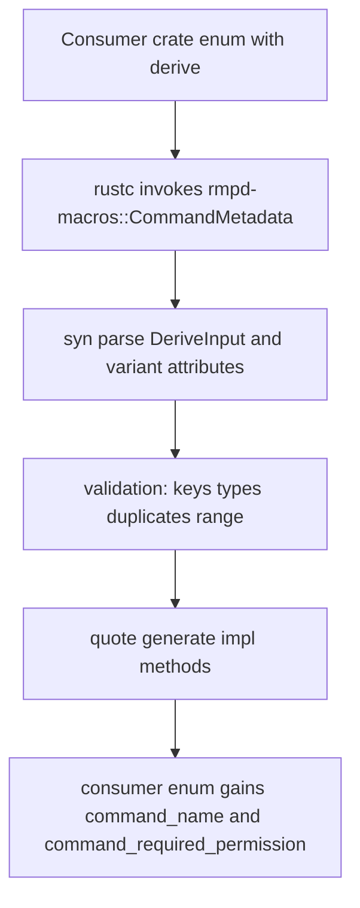
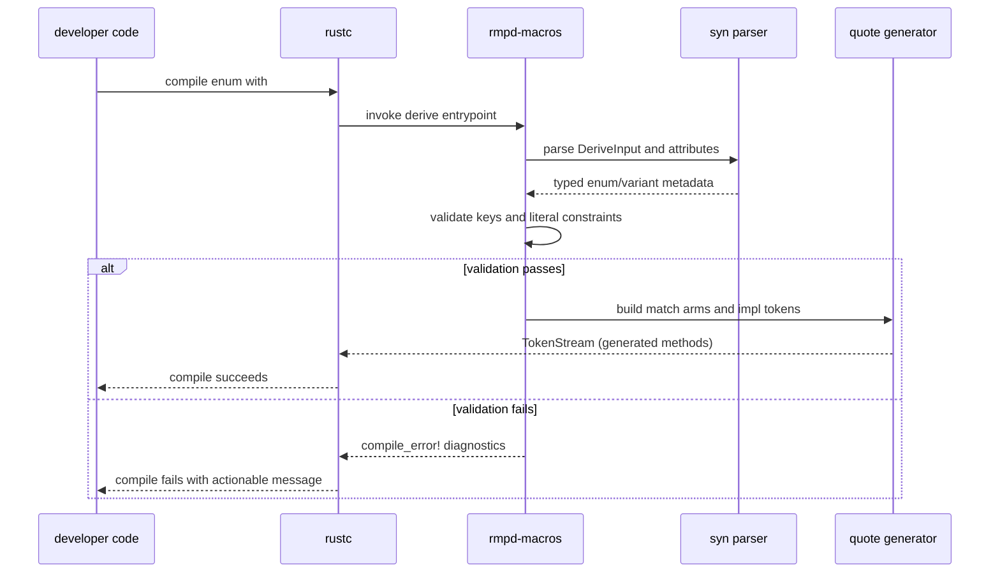

# rmpd-macros Package: Purpose and Flow

This document describes the purpose of the rmpd-macros package in folder rmpd-macros and how its derive macro expands and validates command metadata.

## Purpose

rmpd-macros is the compile-time metadata generator for command enums.

It provides a single proc-macro derive:

- `#[derive(CommandMetadata)]`

The macro reads per-variant `#[command(...)]` attributes and generates methods that expose:

- the command wire name used by MPD-facing layers
- the required permission bitmask (`u8`) for access checks

This prevents hand-written duplicated match blocks and keeps command metadata close to each enum variant declaration.

## Public Surface

The crate is a `proc-macro` library and exports:

- derive macro `CommandMetadata`
- supported helper attribute `command`

Expected variant attribute shape:

```ignore
#[command(name = "play", permission = 4)]
Play { position: Option<u32> },
```

Rules:

- `name` is required and must be a string literal.
- `permission` is optional and defaults to `0`.
- `permission` must fit into `u8`.

## Expansion Flow

Source implementation lives in `rmpd-macros/src/lib.rs`.

At compile time, the macro does the following:

1. Parse the input item as `syn::DeriveInput`.
2. Reject non-enum targets.
3. Iterate enum variants and parse `#[command(...)]` nested metadata.
4. Validate keys and literal types:
   - only `name` and `permission` are accepted
   - duplicate keys are rejected
   - `name` must be string
   - `permission` must be integer parseable as `u8`
5. Build pattern-matching arms for all variant shapes:
   - unit variants
   - named-field variants
   - tuple variants
6. Generate an inherent impl with:
   - `command_name(&self) -> &'static str`
   - `command_required_permission(&self) -> u8`

## Generated API Shape

For a target enum, expansion effectively adds:

```ignore
impl CommandEnum {
    pub fn command_name(&self) -> &'static str { ... }
    pub fn command_required_permission(&self) -> u8 { ... }
}
```

Each method is a `match self` over variants, returning constants derived from attributes.

## Validation and Failure Modes

Compile-time errors are emitted for:

- deriving on a non-enum item
- missing `name` on any variant
- unknown keys (anything besides `name` or `permission`)
- duplicate `name` or duplicate `permission` in one attribute
- non-string `name`
- non-integer `permission`
- out-of-range `permission` values for `u8`

These checks are intentional so malformed metadata cannot silently compile.

## Testing Strategy

The crate validates behavior with two layers:

1. Integration tests (`tests/command_metadata_integration.rs`)
   - verifies generated methods for unit/named/tuple variants
   - verifies generic enum support
   - verifies default permission behavior
2. UI compile-fail tests (`tests/ui/compile_fail/*.rs` via trybuild)
   - pins expected compiler diagnostics for invalid macro usage

This combination protects both positive expansion behavior and precise error reporting.

## Module Interaction Diagram



## Sequence Diagram: Compile-Time Derive Path



## Practical Takeaway

When command metadata is needed by protocol/auth/error paths, encode it once on enum variants and let rmpd-macros generate the accessors.

When adding new command variants, keep attributes complete and let compile-fail checks guard correctness early in CI.

## Related Package Docs

- [rmpd package flow](docs/rmpd-package-flow.md)
- [rmpd-core package flow](docs/rmpd-core-package-flow.md)
- [rmpd-library package flow](docs/rmpd-library-package-flow.md)
- [rmpd-player package flow](docs/rmpd-player-package-flow.md)
- [rmpd-plugin package flow](docs/rmpd-plugin-package-flow.md)
- [rmpd-source package flow](docs/rmpd-source-package-flow.md)
- [rmpd-stream package flow](docs/rmpd-stream-package-flow.md)
