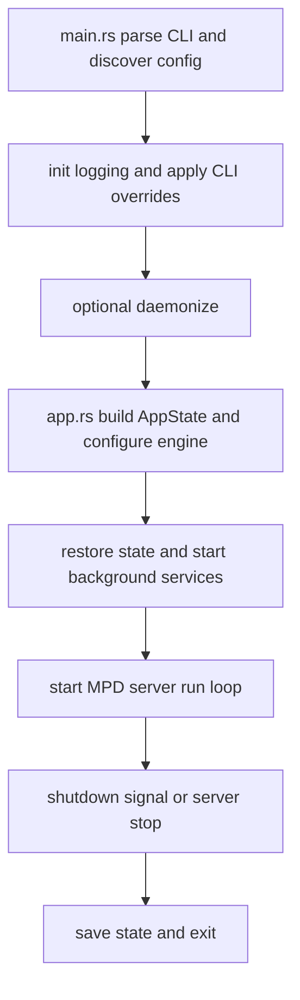

# rmpd Package: Purpose and Runtime Flow

This document describes the purpose of the rmpd package in folder rmpd and how control flows through it at runtime.

## What This Package Is

The rmpd package is the daemon entrypoint and orchestration layer for the project.

It does not implement decoding, playback DSP, protocol command parsing, or library scanning directly. Instead, it wires those subsystems together and owns process lifecycle concerns:

- CLI behavior and config discovery
- logging setup
- daemonization
- application state assembly
- startup restore and background services
- MPD server startup
- graceful shutdown with state persistence

Main files:

- rmpd/src/main.rs
- rmpd/src/app.rs

## High-Level Responsibilities

### main.rs responsibilities

- Parse CLI arguments.
- Resolve and load configuration (or generate/print config path and exit).
- Initialize tracing output (stdout or journald/syslog style path).
- Apply CLI overrides for bind address and port.
- Optionally daemonize on Unix.
- Start the app runtime by calling app::run.

### app.rs responsibilities

- Build protocol AppState using configured paths and options.
- Configure playback engine with audio/output settings.
- Register sources, auth, outputs, and charset warnings.
- Restore prior saved state when available.
- Start optional services: mDNS, MPRIS, initial scan, source sync, filesystem watcher.
- Run MPD TCP/Unix-socket server.
- Save runtime state on shutdown.

## End-to-End Runtime Flow

## 1. Process startup and CLI parsing

Entry function is async main in main.rs.

Flow:

1. Parse Args using clap.
2. Handle utility flags early:
   - --generate-config writes template and exits.
   - --print-config-path prints selected path and exits.
3. Discover config through Config::discover using DiscoverOptions and optional explicit --config path.

Important behavior:

- Configuration is loaded before tracing subscriber initialization so chosen log level can influence first emitted logs.

## 2. Logging initialization

Logging is initialized after config load.

Selection logic:

- If --syslog or --daemonize is enabled:
  - Linux: try journald layer first; fallback to stderr formatter if unavailable.
  - non-Linux: stderr formatter.
- Otherwise: standard stdout formatter.

Log-level source precedence:

1. --verbose forces debug.
2. Otherwise use config general.log_level.
3. RUST_LOG still takes precedence when set because EnvFilter reads default env first.

## 3. Effective bind address selection

Network endpoint is computed by combining:

- CLI --bind / --port when provided
- otherwise config.network values

IPv6 addresses are normalized to bracketed host:port form.

## 4. Optional daemonization

When --daemonize is set (Unix):

- double-fork
- setsid
- redirect stdio to /dev/null
- chdir to /

Then normal server startup continues in detached process context.

## 5. App state assembly in app::run

app::run builds the runtime graph:

1. Create AppState with DB/music/playlist paths.
2. Build source registry from [[source]] config and attach to state.
3. Apply password, symlink policy, and charset warning policy.
4. Configure playback engine:
   - resampler quality
   - DoP mode
   - replay gain settings
   - volume normalization
   - crossfade and mixramp
   - output buffer time
   - enabled outputs set
5. Apply selected output device globally via rmpd_player::set_output_device.
6. Build protocol-visible outputs list for outputs/enableoutput/disableoutput commands.

## 6. State restoration

If state file exists, load is attempted in spawn_blocking so server startup remains async-safe.

Outcomes are explicitly separated:

- loaded state present: restore playback options, outputs, playlist, and possibly resume playback
- no state present: continue silently
- load error or task failure: log and continue startup

Restore behavior details:

- queue restoration tolerates missing songs and adjusts resume position accordingly
- last loaded playlist name is restored independently
- optional auto-resume can start playback in a background task

## 7. Auxiliary services and background tasks

After core state is prepared:

- create shutdown broadcast channel
- register shutdown sender for kill command
- advertise mDNS
- optionally start MPRIS interface
- optionally run initial library scan (if auto_update and music dir exists)
- optionally sync configured remote sources
- optionally start filesystem watcher (if enabled and music dir exists)
- install Ctrl-C shutdown handler that saves state and broadcasts shutdown

Each optional subsystem is fail-soft where practical: startup continues with warnings when a non-critical component is unavailable.

## 8. Server run loop

The MPD server is created with:

- bind address
- shared AppState
- shutdown receiver
- optional Unix socket
- max connections
- connection timeout

server.run() is awaited until shutdown or fatal server error.

## 9. Shutdown path

On shutdown:

1. Log server stop.
2. Persist state to state file.
3. Return server result.

Ctrl-C path sends shutdown signal and also saves state before signal broadcast.

## Configuration and Control Precedence Summary

### Bind/port

1. CLI flags
2. config.network values

### Log level

1. RUST_LOG env filter (if set)
2. else --verbose forces debug
3. else config.general.log_level

### DoP policy

- Configured in app layer through engine.set_dop_mode.
- Runtime DoP behavior is ultimately enforced by rmpd-player engine/output checks.

## Failure Model

The package is designed to keep daemon startup resilient:

- Missing or invalid optional integrations produce warnings, not hard-fail, where feasible.
- State restoration failures do not block startup.
- Missing music directory disables scan/watch with clear logs.
- Critical failures (for example server bind/run failure) propagate as returned errors.

## Why This Package Exists Separately

Keeping this orchestration in rmpd allows lower-level crates to stay focused:

- rmpd-player: playback engine and outputs
- rmpd-protocol: MPD protocol state and server
- rmpd-library: DB/scan/watch
- rmpd-source: external catalog sources
- rmpd-core: shared config, error, models

This separation keeps the daemon entrypoint thin and operationally focused while core functionality remains reusable and testable in dedicated crates.

## Related Package Docs

- [rmpd-core package flow](docs/rmpd-core-package-flow.md)
- [rmpd-library package flow](docs/rmpd-library-package-flow.md)
- [rmpd-macros package flow](docs/rmpd-macros-package-flow.md)
- [rmpd-player package flow](docs/rmpd-player-package-flow.md)
- [rmpd-plugin package flow](docs/rmpd-plugin-package-flow.md)
- [rmpd-source package flow](docs/rmpd-source-package-flow.md)
- [rmpd-stream package flow](docs/rmpd-stream-package-flow.md)

## Quick Flow Diagram

