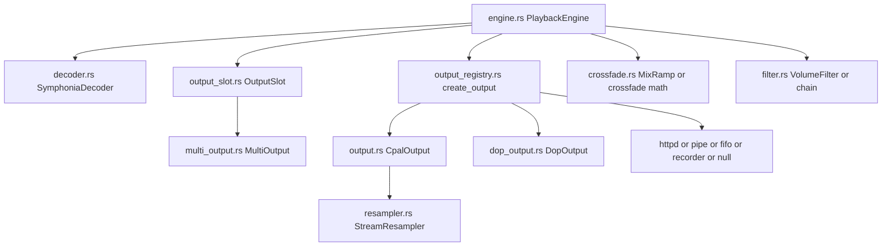
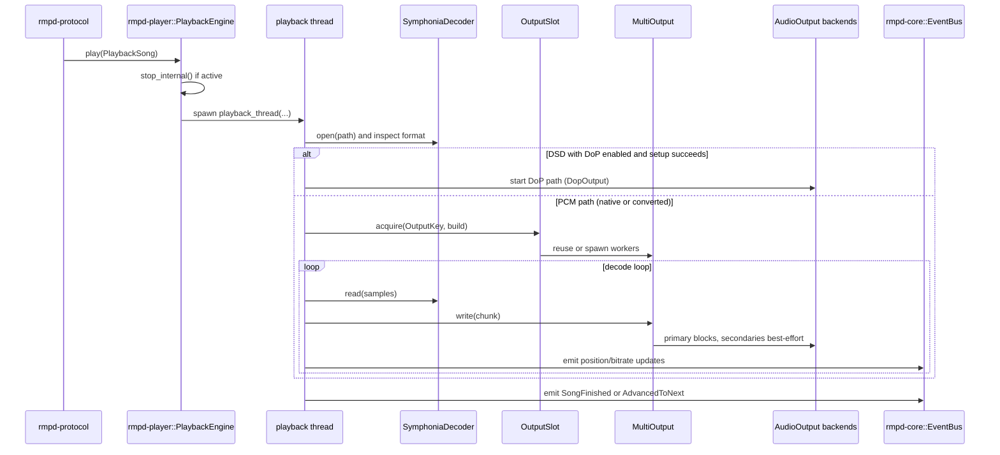

# rmpd-player Package: Purpose and Flow

This document describes the purpose of the rmpd-player package in folder rmpd-player and how audio and control flow through its modules.

## Purpose

rmpd-player is the playback runtime for the project.

It owns:

- decode and stream-format probing
- playback-thread orchestration and transport state transitions
- DSD handling (native DoP and DSD-to-PCM fallback)
- sample-rate conversion and sample-format conversion
- output backend construction and fan-out
- gapless/crossfade transition primitives and output reuse
- network/file/pipe/null output implementations

It intentionally does not own MPD command parsing, playlist policy, or library scanning. Those live in protocol/library crates and call into this package.

## Public Surface

From src/lib.rs, key exports include:

- Playback and decode:
  - PlaybackEngine
  - SymphoniaDecoder, Decoder, DecoderPlugin, decoder_for_suffix, is_supported_suffix
- DSD and conversion:
  - DopEncoder
  - CpalOutput
  - set_output_device
- Output composition and registration:
  - MultiOutput
  - OutputSlot, OutputKey
  - create_output, OUTPUT_PLUGINS
- Filters and mixers:
  - AudioFilter, FilterChain, VolumeFilter, Mixer, SoftwareMixer
- Streaming encoders:
  - Encoder, PcmEncoder, WavEncoder

## Module Responsibilities

- engine.rs: top-level playback lifecycle and thread orchestration.
- decoder.rs: Symphonia-based file/stream decode with runtime format confirmation.
- output_registry.rs: output-type routing and backend factory dispatch.
- output.rs: cpal PCM backend with optional StreamResampler bridge.
- dop.rs + dop_output.rs: native DoP packer and I32 DoP output path.
- multi_output.rs: primary-clocked fan-out to N outputs with non-blocking secondaries.
- output_slot.rs: same-format output reuse cache for gapless device persistence.
- resampler.rs: rubato-based streaming SRC quality profiles.
- filter.rs: in-place DSP chain and software mixer seam.
- crossfade.rs: pure equal-power/MixRamp primitives used by engine transitions.
- httpd_output.rs, fifo_output.rs, pipe_output.rs, recorder_output.rs, null_output.rs:
  concrete output backends.

## End-to-End Playback Flow

## 1. Entry and thread startup

Primary entry is PlaybackEngine::play.

Flow:

1. Stop existing playback internally (without external song-change event).
2. Set current song and now-playing title for httpd metadata.
3. Reset stop flag and create command channel.
4. Spawn blocking playback thread with a frozen snapshot of playback config
   (outputs, gain settings, resampler quality, DoP mode, crossfade/mixramp, range).

Design intent:

- Keep the real-time decode/write loop off async executors.

## 2. Decoder open and format path selection

Inside playback_thread:

1. Open SymphoniaDecoder for local file or HTTP stream.
2. If stream is DSD:
   - evaluate DoP enable policy (env override or configured mode)
   - try native DoP setup
   - if DoP setup fails, log classified fallback reason and continue with PCM conversion
3. For DSD-to-PCM, choose a practical decode rate and decide device target-rate behavior.
4. For non-DSD (or converted DSD), query runtime-confirmed format info.

Design intent:

- Prefer correctness and audible stability: native DoP when available, deterministic PCM fallback otherwise.

## 3. Output creation and reuse

Flow:

1. Build an OutputKey from sample rate, channels, bit depth, and output signature.
2. Acquire a cached MultiOutput via OutputSlot::acquire:
   - same key: reuse existing open output graph (gapless win)
   - changed key: rebuild outputs
3. For each enabled output config, create backend via create_output.
4. Spawn worker threads through MultiOutput::spawn.

Notable policy:

- primary output is clock-bearing and backpressures decode
- secondary outputs are best-effort drop-on-full

## 4. Main decode/write loop

Flow:

1. Poll command channel (seek handling).
2. Honor pause state via atomic state and MultiOutput pause/resume calls.
3. Decode interleaved f32 chunks.
4. Apply source-side gain scaling (ReplayGain/normalization path).
5. Write chunk into MultiOutput.
6. Emit position and bitrate events on throttle.

Range handling:

- optional range cutoffs truncate final chunk and finish playback at boundary.

## 5. Transition logic: gapless and crossfade

When next_song is pre-fed:

- crossfade path: overlap current and next decoder streams using equal-power gains
  and optional MixRamp-derived window.
- gapless path: if end-of-stream is reached with compatible next format,
  switch decoders in-thread while keeping MultiOutput alive.

When no compatible next_song exists:

- emit SongFinished and exit playback thread.

Design intent:

- make same-format transitions continuous by avoiding device teardown.

## 6. DoP-specific runtime path

Native DoP path uses DopEncoder + DopOutput.

- DoP output requires I32-safe format and bounded-channel send behavior.
- write-drop streaks are tracked and warning cadence is thresholded.
- on setup failure, playback falls back to PCM conversion path instead of aborting playback.

## 7. Stop, pause, and state consistency

- stop(): sets stop flag, joins playback thread, clears look-ahead, clears output slot,
  publishes stop-oriented events and now-playing reset.
- pause()/set_pause(): update atomic state without blocking.
- playback thread marks Play state only after successful startup.

Design intent:

- keep externally visible state aligned with actual output readiness.

## 8. Output backend ecosystem

Registry-driven backends support:

- local device outputs (cpal, optional pipewire/jack/asio)
- network output (httpd with WAV/PCM encoders and optional ICY metadata)
- integration outputs (fifo, pipe, recorder)
- null output for silent but time-coherent progression

This lets runtime select per-output behavior from config without changing engine logic.

## Module Interaction Diagram

## Sequence Diagram: Playback Lifecycle

## Practical Takeaway

When a change affects playback timing, output startup behavior, DoP/PCM policy, crossfade transitions, or output backpressure semantics, rmpd-player is usually the correct package.

When a change affects queue policy, command authorization, or library catalog semantics, higher-level crates should consume this package rather than duplicating playback logic.

## Related Package Docs

- [rmpd package flow](docs/rmpd-package-flow.md)
- [rmpd-core package flow](docs/rmpd-core-package-flow.md)
- [rmpd-library package flow](docs/rmpd-library-package-flow.md)
- [rmpd-macros package flow](docs/rmpd-macros-package-flow.md)
- [rmpd-plugin package flow](docs/rmpd-plugin-package-flow.md)
- [rmpd-source package flow](docs/rmpd-source-package-flow.md)
- [rmpd-stream package flow](docs/rmpd-stream-package-flow.md)
