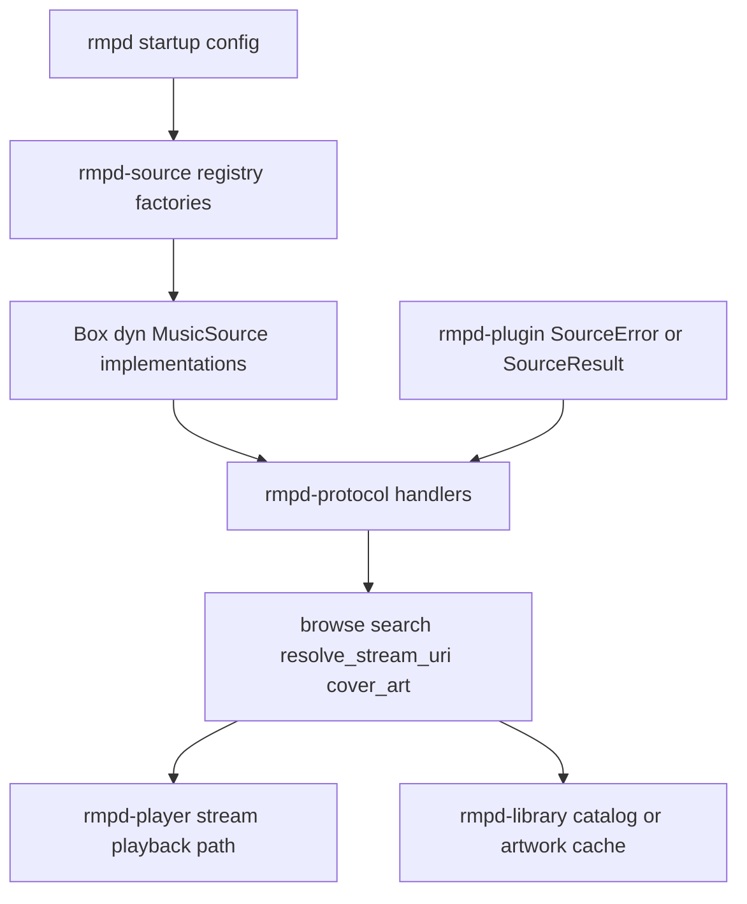
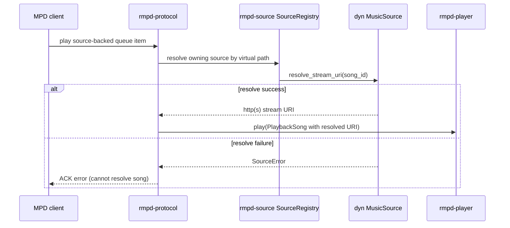

# rmpd-plugin Package: Purpose and Flow

This document describes the purpose of the rmpd-plugin package in folder rmpd-plugin and how its SPI contracts are used at runtime.

## Purpose

rmpd-plugin is the plugin contract crate.

It defines stable, dependency-light service-provider interfaces (SPIs) that backend crates implement and runtime crates consume.

Current scope:

- music-source SPI (`MusicSource`)
- source-domain result and error types (`SourceResult`, `SourceError`)
- source browse entry model (`SourceEntry`)

Non-goals:

- no backend implementation details
- no registry ownership
- no network/file I/O logic
- no dynamic `.so` loading runtime

Concrete source implementations and compile-time registry wiring live in rmpd-source.

## Public Surface

From src/lib.rs and src/source.rs, this package exports:

- `MusicSource` trait
- `SourceEntry` enum
- `SourceError` enum
- `SourceResult<T>` alias

## Design Boundaries

Dependency policy is intentionally narrow:

- `async-trait` for async object-safe trait methods
- `rmpd-core::song::Song` for shared song model

This keeps backend contracts reusable without pulling heavy implementation crates into every consumer.

## SPI Model and Lifecycle

The source plugin model is compile-time selected and runtime invoked.

Lifecycle:

1. Host startup builds source instances from config through rmpd-source registry factories.
2. Host stores boxed `dyn MusicSource` objects in a source registry.
3. Protocol commands and background sync tasks call SPI methods asynchronously.
4. Backends return typed `SourceError` variants that host layers map to user-visible errors and logs.

Important property:

- registry lookup/factory selection is sync and no-I/O; I/O happens only inside trait calls.

## MusicSource Contract Flow

Core trait responsibilities:

- `scheme()` and `name()` define virtual path namespace ownership
- `ping()` validates liveness/auth without leaking secrets
- `browse(dir)` returns one virtual directory level (`Song` or `Dir` entries)
- `list_all()` enumerates full source catalog for update/sync jobs
- `search(query)` executes source-native search
- `resolve_stream_uri(song_id)` maps source IDs to playable HTTP(S) stream URIs
- `cover_art(song_id)` returns optional raw artwork bytes (default `Ok(None)`)

Design intent:

- keep the host-side control flow uniform for local and remote catalogs
- isolate transport-specific behavior in backend crates

## Error Semantics

`SourceError` classifies failures into transport-agnostic categories:

- `Unreachable`
- `Auth`
- `NotFound`
- `Protocol`
- `Config`

Security contract:

- Display/Debug output must not contain credentials or secrets.
- inner messages are treated as log-safe opaque summaries.

## Host Integration Flow

Typical call paths using this SPI:

1. Playback preparation resolves mount-style virtual song paths via `resolve_stream_uri`.
2. Source sync pings each source, then imports `list_all()` results into the catalog DB.
3. Browse/search protocol handlers call `browse`/`search` for source-backed trees.
4. Artwork endpoints call `cover_art` for remote sources, then cache bytes in library/artwork cache.

## Module Interaction Diagram

## Sequence Diagram: Source-Backed Playback Resolve

## Practical Takeaway

When defining backend-neutral source capabilities or error taxonomy, rmpd-plugin is the right package.

When implementing concrete source behavior, registry factories, or network protocol adapters, use rmpd-source and keep this package contract-focused.

## Related Package Docs

- [rmpd package flow](docs/rmpd-package-flow.md)
- [rmpd-core package flow](docs/rmpd-core-package-flow.md)
- [rmpd-library package flow](docs/rmpd-library-package-flow.md)
- [rmpd-macros package flow](docs/rmpd-macros-package-flow.md)
- [rmpd-player package flow](docs/rmpd-player-package-flow.md)
- [rmpd-source package flow](docs/rmpd-source-package-flow.md)
- [rmpd-stream package flow](docs/rmpd-stream-package-flow.md)
