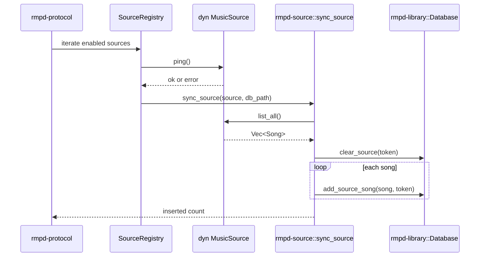
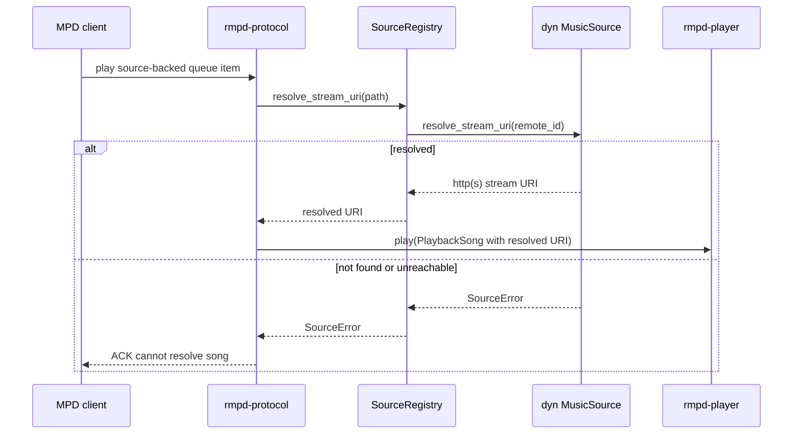

# rmpd-source Package: Purpose and Flow

This document describes the purpose of the rmpd-source package in folder rmpd-source and how source backends are selected and used at runtime.

## Purpose

rmpd-source is the source-backend implementation and registry crate.

It provides:

- a compile-time source plugin registry (name to factory mapping)
- runtime source container (`SourceRegistry`) built from `[[source]]` config blocks
- concrete backend implementations
  - `FilesystemSource` (always available)
  - `SubsonicSource` (feature-gated: `subsonic`)
- source catalog sync helper (`sync_source`) into local database
- mount-style virtual path ownership and stream/artwork resolution helpers

It intentionally does not define the source SPI trait itself. The contract lives in rmpd-plugin and is consumed here.

## Public Surface

From rmpd-source public exports:

- `SOURCE_PLUGINS`
- `SourceFactory`
- `create_source`
- `SourceRegistry`
- `sync_source`
- re-exported SPI types from rmpd-plugin:
  - `MusicSource`, `SourceEntry`, `SourceError`, `SourceResult`

## Design Boundaries

- `rmpd-plugin`: defines SPI contracts and error taxonomy.
- `rmpd-source`: implements SPI backends and registry plumbing.
- `rmpd-protocol`: owns command routing and calls this crate through `AppState.sources`.
- `rmpd-library`: owns persistence; `sync_source` writes source-tagged catalog rows there.

## Compile-Time Registry Flow

Primary files: src/registry.rs and src/lib.rs.

Flow:

1. `SOURCE_PLUGINS` is a static ordered list of (`source_type`, factory).
2. `create_source(cfg)` lowercases `cfg.source_type` and selects matching factory.
3. Unknown types return `SourceError::Config`.
4. Feature gates decide which backends are compiled (for example `subsonic`).

Design intent:

- deterministic, no-I/O source selection at startup
- MPD-style compile-time plugin model without dynamic shared library loading

## Runtime Registry Flow

Primary file: src/lib.rs (`SourceRegistry`).

Flow:

1. `SourceRegistry::from_config` iterates `[[source]]` blocks.
2. Disabled blocks are skipped.
3. Factory failures are logged and skipped (fail-soft startup).
4. Successful backends are stored as boxed `dyn MusicSource` values.

Runtime helpers:

- `owning_source(path)`: mount-point ownership by first path segment
- `owns_path(path)`: boolean ownership predicate
- `resolve_stream_uri(path)`: extract remote id and call backend
- `cover_art(path)`: extract remote id and fetch optional art bytes

## Virtual Path and ID Recovery Flow

Mount-style source paths are owned by source name as top-level segment:

- `<source-name>/<artist>/<album>/<id>[.<suffix>]`

Resolution behavior:

1. Detect owning source by first segment.
2. Extract trailing leaf.
3. Strip known audio extension (case-insensitive) when present.
4. Use resulting id for `resolve_stream_uri` or `cover_art`.

This keeps display-oriented suffixes while preserving backend ID round-trip.

## Backend Flow: FilesystemSource

Primary file: src/filesystem.rs.

Behavior:

- `ping`: verifies configured music directory is accessible and a directory.
- `browse`: delegates to `Database::list_directory` through `spawn_blocking`.
- `list_all`: delegates to `Database::list_all_songs` through `spawn_blocking`.
- `search`: delegates to `Database::search_songs` through `spawn_blocking`.
- `resolve_stream_uri`: returns `NotFound` intentionally for local paths.

Design intent:

- local and remote sources share one abstraction, while local playback still uses direct filesystem paths.

## Backend Flow: SubsonicSource

Primary file: src/subsonic.rs (enabled by feature `subsonic`).

Behavior:

- factory validates config/auth mode and builds client without immediate network I/O.
- supported auth is either `api_key` or `username` + `password`.
- HTTPS is required by default; `allow_insecure_http = true` permits plain HTTP.
- `accept_invalid_certs = true` disables TLS certificate verification (warn-logged).
- `ping`: validates connectivity/auth.
- `browse`: root-level artist directory listing.
- `list_all`: paginates album list, fetches album songs concurrently, maps to virtual songs.
- `search`: remote search mapped to `Song` values.
- `resolve_stream_uri`: computes direct stream URL for backend song id.
- `cover_art`: fetches bytes; failures map to `Ok(None)` for fail-soft art behavior.

Safety and privacy:

- credential fields are redacted in debug output.
- error mapping classifies auth/network/protocol categories without leaking secrets.

## Source Sync Flow

Primary helper: `sync_source(source, db_path)`.

Flow:

1. Call `source.list_all()` asynchronously.
2. Build source token `<scheme>:<name>`.
3. In `spawn_blocking`, open database and replace source rows transactionally:
   - `clear_source(token)`
   - `add_source_song(song, token)` for each song
4. Return inserted count.

Design intent:

- keep async network and blocking SQLite work separated
- preserve source isolation through explicit source token scoping

## Integration Touchpoints

- protocol playback preparation resolves source-backed paths to stream URIs via `SourceRegistry`.
- protocol update/sync workflows call `sync_source` for enabled sources.
- library/artwork paths can call `cover_art` for remote source media.

## Module Interaction Diagram

```mermaid
flowchart TD
    A[rmpd config [[source]]] --> B[rmpd-source create_source]
    B --> C[SOURCE_PLUGINS]
    C --> D[FilesystemSource]
    C --> E[SubsonicSource feature-gated]
    D --> F[SourceRegistry]
    E --> F
    F --> G[rmpd-protocol command routing]
    G --> H[resolve_stream_uri or browse or search]
    H --> I[rmpd-player playback URI input]
    G --> J[sync_source]
    J --> K[rmpd-library database source rows]
```

## Sequence Diagram: Source Sync



## Sequence Diagram: Playback URI Resolution



## Practical Takeaway

When adding or changing concrete music-source backends, registry selection, virtual path ownership, or source-to-database sync behavior, rmpd-source is the correct package.

When changing source contract semantics, update rmpd-plugin first and keep this crate as the implementation layer.

## Related Package Docs

- [rmpd package flow](docs/rmpd-package-flow.md)
- [rmpd-core package flow](docs/rmpd-core-package-flow.md)
- [rmpd-library package flow](docs/rmpd-library-package-flow.md)
- [rmpd-macros package flow](docs/rmpd-macros-package-flow.md)
- [rmpd-player package flow](docs/rmpd-player-package-flow.md)
- [rmpd-plugin package flow](docs/rmpd-plugin-package-flow.md)
- [rmpd-stream package flow](docs/rmpd-stream-package-flow.md)
