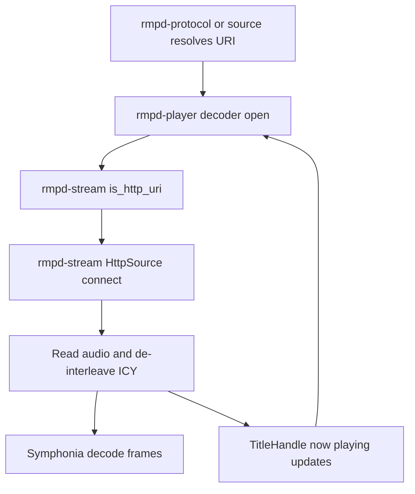
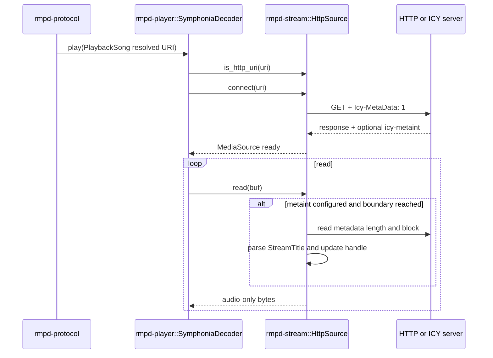
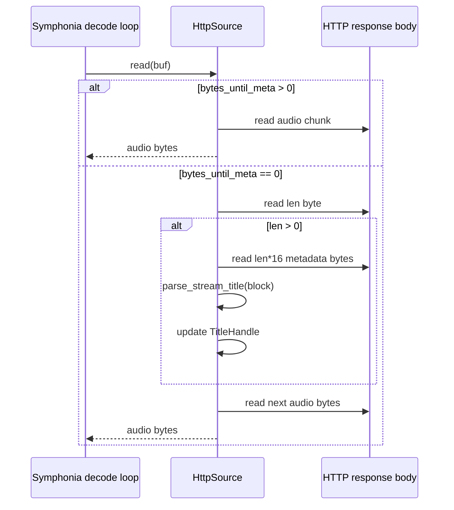

# rmpd-stream Package: Purpose and Flow

This document describes the purpose of the rmpd-stream package in folder rmpd-stream and how stream data flows through it.

## Purpose

rmpd-stream is the HTTP(S) streaming input adapter used by playback decode.

It provides:

- remote stream URI detection (`is_http_uri`)
- blocking HTTP stream connection (`HttpSource::connect`)
- Symphonia `MediaSource` implementation for remote streams (`HttpSource`)
- ICY metadata de-interleaving (strip metadata, pass pure audio bytes)
- shared now-playing title extraction (`TitleHandle` + `parse_stream_title`)

It intentionally does not decode codecs or control playback state; rmpd-player consumes this crate.

## Public Surface

From src/lib.rs, the package exports:

- `is_http_uri(uri: &str) -> bool`
- `HttpSource`
  - `connect(url: &str) -> io::Result<HttpSource>`
  - `with_reader(reader, metaint) -> HttpSource`
  - `title_handle() -> TitleHandle`
- `TitleHandle` (`Arc<Mutex<Option<String>>>`)
- `parse_stream_title(block: &[u8]) -> Option<String>`

## Architectural Role

rmpd-stream sits between network transport and Symphonia decoding.

Flow ownership:

- network I/O and ICY metadata framing: rmpd-stream
- codec probing/decoding and playback loop: rmpd-player

This separation keeps streaming transport behavior testable without decoder complexity.

## End-to-End Flow

## 1. Stream detection and connect

Primary entry in callers:

1. Playback path tests URI with `is_http_uri`.
2. For HTTP(S), construct `HttpSource::connect(url)`.
3. Request includes `Icy-MetaData: 1` header.
4. If response includes `icy-metaint`, store metadata interval; otherwise stream is passthrough.

Connection behavior:

- blocking reqwest client
- connect timeout and per-read idle timeout configured
- non-success HTTP status returns error

## 2. Read pipeline and ICY handling

`HttpSource` implements `Read` and is consumed by Symphonia as a byte source.

When ICY metadata is disabled (`metaint = None`):

- every read is passthrough from underlying response body.

When ICY metadata is enabled:

1. Track `bytes_until_meta` countdown.
2. At boundary, read one length byte.
3. Length byte value times 16 gives metadata block size.
4. Read metadata block fully.
5. Parse optional `StreamTitle='...';` and update shared title handle.
6. Resume returning audio bytes only.

Result:

- decoder receives clean audio payload with metadata bytes removed.

## 3. Title extraction flow

Title parsing uses `parse_stream_title`:

- scans metadata text for `StreamTitle=`
- extracts quoted value
- trims whitespace
- returns `None` for empty/missing title

`TitleHandle` semantics:

- latest non-empty parsed title is stored as shared mutable state
- consumer (decoder/playback layer) reads it opportunistically

## 4. Seek semantics

`HttpSource` is non-seekable by design:

- `MediaSource::is_seekable()` returns `false`
- `byte_len()` returns `None`
- `seek(SeekFrom::Current(0))` is tolerated
- all other seek requests return `Unsupported`

This matches live/infinite stream behavior.

## 5. Error and EOF behavior

- request/connect/status failures map to `io::Error`
- truncated metadata block is treated as `UnexpectedEof`
- EOF at metadata boundary cleanly ends stream

Design intent:

- fail predictably without spinning or wedging the decode thread.

## Integration Points

- rmpd-player decoder uses `is_http_uri` to branch local-file vs remote-stream open.
- rmpd-player constructs `HttpSource` and feeds it into Symphonia media source stream.
- remote source resolution from rmpd-source/rmpd-protocol yields HTTP(S) URIs consumed unchanged by this crate.
- httpd output tests reuse `parse_stream_title` to validate ICY metadata compatibility.

## Module Interaction Diagram

## Sequence Diagram: Remote Stream Playback Open

## Sequence Diagram: ICY Metadata Boundary

## Practical Takeaway

When behavior changes involve remote stream transport, ICY parsing, stream timeout policy, or stream-source-to-decoder byte semantics, rmpd-stream is the correct package.

When behavior changes involve codec decode logic, playback state, or output routing, update rmpd-player and keep rmpd-stream transport-focused.

## Related Package Docs

- [rmpd package flow](docs/rmpd-package-flow.md)
- [rmpd-core package flow](docs/rmpd-core-package-flow.md)
- [rmpd-library package flow](docs/rmpd-library-package-flow.md)
- [rmpd-macros package flow](docs/rmpd-macros-package-flow.md)
- [rmpd-player package flow](docs/rmpd-player-package-flow.md)
- [rmpd-plugin package flow](docs/rmpd-plugin-package-flow.md)
- [rmpd-source package flow](docs/rmpd-source-package-flow.md)
